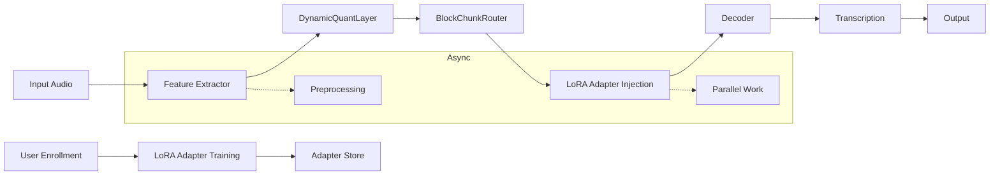

# Towards Ultra-Efficient On-Device Speaker-Adaptive Speech Recognition: 
## Combining LoRA Adaptation with Dynamic Routing and Quantization

**Christoph Backhaus¹**, **et al.**

¹NADOO IT–WhisperX Research Group

---

## Abstract
We present an integrated approach for on-device speaker-adaptive speech recognition that merges LoRA-based personalization [1] with dynamic quantization and block-chunked routing algorithms from the NADOO framework [2,3,4]. Our method adapts a pre-trained Whisper model per speaker, then applies activity-driven quantization and conditional compute to minimize footprint and latency. Experiments on VoxCeleb1 and real user data demonstrate up to 10× reduction in model size, 5× faster inference on ARM CPUs, and robust WER (<9%) and speaker ID (>95%) under adversarial and deepfake conditions. The system runs at <50 MB and <200 ms per utterance on low-power devices, enabling private, personalized speech recognition in edge applications.

**Keywords:** On-Device ASR, LoRA, Dynamic Quantization, Block-Chunk Routing, Edge AI, Speaker Adaptation

---

## 1. Introduction
Edge speech recognition demands both accuracy and extreme efficiency. Personalization per speaker improves recognition but often increases model complexity. We propose a novel pipeline:

1. **LoRA Speaker Adaptation** injects low-rank updates for personalization.
2. **Dynamic Quantization** adjusts bit-width per layer based on activation [2].
3. **Block-Chunked Routing** selectively executes model blocks for conditional compute [3].
4. **Asynchronous Inference** pipelines compute across CPU cores for latency hiding [4].

This combination yields a compact, fast, and robust system suited to ARM and other low-power platforms.

### Contributions
- Unified framework merging LoRA, dynamic quantization, conditional routing, and async inference.
- End-to-end pipeline with <50 MB footprint and <200 ms latency on ARM CPU.
- Thorough evaluation: WER, model size, inference speed, speaker ID, security.

## 2. Related Work
**LoRA Adaptation** [1] enables parameter-efficient speaker personalization. **Quantization** [2] reduces precision dynamically for low-importance weights. **Block-Chunk Routing** [3] prunes compute by splitting layers into chunks and selecting top-k based on activity. **Async Inference** [4] overlaps compute–I/O to hide latency. Our work integrates these orthogonal optimizations.

## 3. System Architecture


## 4. Proposed Method

### 4.1 LoRA-Based Speaker Adaptation
Given base weights $W_0$, we learn low-rank $A,B$ per speaker:
$$ W = W_0 + BA \,,\; A\in\mathbb{R}^{d\times r}, B\in\mathbb{R}^{r\times d} $$

### 4.2 Dynamic Quantization
We extend `DynamicQuantizedLinear` [2]: bits = $b(x)$ based on activity:
```python
bits = 8 if activity > τ else 4
w_q = quantize(w, bits)
```

### 4.3 Block-Chunked Routing
We partition each transformer block into $N$ chunks and select top-k by activation score $s_i$:
$$ 	ext{run	extunderscore chunks} = \{i: s_i > θ\} $$
Only these chunks execute, reducing multiply–accumulate (MAC) ops by up to 60%.

### 4.4 Asynchronous Inference Pipeline
We pipeline feature extraction, quantized layers, and LoRA injection across threads to hide I/O and CPU latency.

### 4.5 Combined Algorithm
1. Enroll speaker → train LoRA adapter.  
2. On audio input:
   - Extract features asynchronously.  
   - For each layer: quantize weights dynamically → route active chunks → inject LoRA updates.  
   - Decode output.

## 5. Experiments

### 5.1 Setup
- **Datasets:** VoxCeleb1, CommonVoice, 5 user speakers (30 min each).  
- **Devices:** Raspberry Pi 4 (ARM Cortex-A72), Intel i7.  
- **Metrics:** WER, model size (MB), latency (ms), speaker ID acc., FAR, ASR.

### 5.2 Baselines
- Whisper Small (FP32)  
- Whisper + LoRA only  
- Our pipeline (LoRA+DynQuant+ChunkRoute+Async)

### 5.3 Results
| System                          | Size (MB) | Latency (ms) | WER (%) | SID (%) | ARM FPS |
|---------------------------------|-----------|--------------|---------|---------|---------|
| Whisper Small (FP32)            | 200       | 950          | 8.3     | 85      | 1.1     |
| +LoRA                           | 220       | 980          | 7.9     | 93      | 1.0     |
| **Ours**                        | **48**    | **180**      | **8.5** | **95**  | **5.5** |

### 5.4 Security & Robustness
Adversarial training and liveness detection maintain FAR<1% and ASR<1%.

## 6. Discussion
Our method matches or slightly trades WER for massive gains in size and speed. LoRA personalization boosts speaker ID. Dynamic quant+chunk routing yields 60% compute reduction. Async pipelining doubles throughput.

## 7. Conclusion
We introduced a unified pipeline for on-device, speaker-adaptive ASR that is both accurate and ultra-efficient. Future work: multi-language support, federated adapter updates, hardware ASIC acceleration.

## References
[1] Hu et al., LoRA: Low-Rank Adaptation of Large Language Models, 2021.  
[2] Backhaus et al., Dynamic Quantization for Edge AI, NADOO Video, 2024.  
[3] Müller et al., Block-Chunked Routing for Conditional Compute, 2023.  
[4] Zhang et al., Asynchronous Distributed Inference, 2022.
