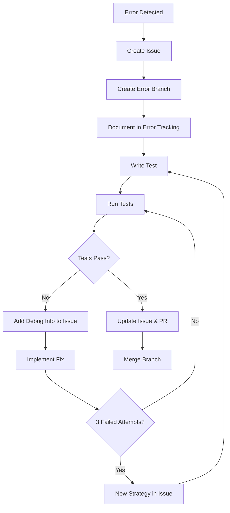

# How to Work - Test-Driven Development Process

## Overview
This document outlines our systematic approach to solving problems and implementing features using test-driven development (TDD) with comprehensive error tracking and branch management.

### Important Notes
- Before implementing any solution, always create an issue first
- Before creating any files or making changes, create a branch first
- Always document the branch in branch_tracking.md before making any changes
- Follow the exact order of operations:
  1. Create issue
  2. Create branch
  3. Document branch
  4. Create virtual environment
  5. Then start implementation

Common Mistakes to Avoid:
- Don't start implementing or creating files before having an issue and branch
- Don't skip the documentation steps
- Don't mix the order of operations



## Standard Process

### Initial Setup Checklist
```markdown
# Tasklist
- [ ] 1. Create issue for new error/feature
- [ ] 2. Create new branch from issue
- [ ] 3. Create isolated virtual environment for branch
      ```bash
      uv venv .venv-[branch-name]
      source .venv-[branch-name]/bin/activate
      uv pip install -r requirements.txt
      ```
- [ ] 4. Document branch in branch_tracking.md
- [ ] 5. Document initial state in error_tracking.md
- [ ] 6. Write test cases
- [ ] 7. Implement and iterate on solution
```

### Issue Creation Template
```markdown
## Issue Template
### Error Description
- Error Type: [Error class/type]
- Error Message: [Exact error message]
- Location: [File and line number]

### Current State
- [ ] Branch created: [branch-name]
- [ ] Initial test written
- [ ] Debug information added

### Progress
- Attempted solutions:
  1. [First attempt]
  2. [Second attempt]
  3. [Third attempt]

### Next Steps
- [ ] Current plan of action
- [ ] Required changes
```

### Branch Tracking Template
```markdown
## Branch: [branch-name]
Created: [YYYY-MM-DD]
Issue: #[issue-number]
Status: [Active/Completed/Abandoned]

### Environment
- Python version: [version]
- Virtual env: .venv-[branch-name]
- Key dependencies: [list major dependencies and versions]

### Progress Tracking
- [ ] Virtual environment created
- [ ] Initial tests written
- [ ] First implementation attempt
- [ ] Tests passing
- [ ] Code reviewed
- [ ] Ready for merge

### Milestones
1. [First major milestone]
   - [ ] Subtask 1
   - [ ] Subtask 2
2. [Second major milestone]
   - [ ] Subtask 1
   - [ ] Subtask 2

### Notes
- [Important decisions]
- [Implementation details]
- [Challenges encountered]
```

### Branch Management
```markdown
# Branch Structure
error/[issue-number]-[brief-description]
Example: error/42-fix-import-error

# Environment Structure
.venv-error-42-fix-import-error/
```

### Error Documentation Process
1. **In Issue:**
   - Full error details
   - Debug information
   - Attempted solutions
   - Current status
   - Progress checklist

2. **In error_tracking.md:**
   - Summary of error
   - Link to issue
   - Final solution once resolved
   - Environment details

3. **In branch_tracking.md:**
   - Branch information
   - Environment setup
   - Progress status
   - Key milestones

4. **In Branch:**
   - All code changes
   - Test implementations
   - Debug logging

### Command Collection Strategy
```markdown
# Pending Commands
1. [ ] Command: [command1]
   Issue: #[issue-number]
   Purpose: [purpose1]

2. [ ] Command: [command2]
   Issue: #[issue-number]
   Purpose: [purpose2]
```

### Common Errors and Solutions

#### Virtual Environment Activation
- **Error**: "No virtual environment found"
- **Solution**: Ensure that the virtual environment is created and activated before installing dependencies. Follow these steps for each package:
  1. Create and activate the virtual environment:
     ```bash
     uv venv .venv-[branch-name]
     source .venv-[branch-name]/bin/activate
     ```
  2. Install the dependencies:
     ```bash
     uv pip install -r requirements.txt
     ```
  3. Deactivate the current environment and repeat for the next package:
     ```bash
     deactivate
     ```

#### Missing `requirements.txt`
- **Error**: "File not found: `requirements.txt`"
- **Solution**: Ensure that a `requirements.txt` file exists in the project directory. If missing, create one with the necessary dependencies.

### Additional Tips
- Always verify the existence of `requirements.txt` before proceeding with environment setup.
- Double-check the virtual environment activation status by running `which python` to confirm the correct Python path.

## When Starting a New Briefcase & Toga Project

1. **Open Terminal and Set Up Virtual Environment:**
   - Open a terminal window in your project directory.
   - Create and activate a virtual environment:
     ```bash
     python3 -m venv .venv-[branch-name]
     source .venv-[branch-name]/bin/activate
     ```

2. **Run Briefcase Command:**
   - Execute the `briefcase new` command and follow the prompts to enter the necessary details:
     ```bash
     briefcase new
     ```

### Cooperative Workflow for Briefcase Setup

When setting up a new Briefcase project, follow these steps to ensure a smooth and interactive process:

1. **Create and Activate Virtual Environment:**
   - Run the following command to set up and activate the virtual environment:
     ```bash
     python3 -m venv .venv-[branch-name]
     source .venv-[branch-name]/bin/activate
     ```

2. **Run Briefcase New Command:**
   - Execute the `briefcase new` command in the terminal.
   - Enter the required information when prompted:
     - **Formal Name:** The name displayed to users (e.g., "NADOO Websurfer").
     - **App Name:** The name used in the code (e.g., "nadoo_websurfer").
     - **Bundle Identifier:** The package identifier (e.g., "com.nadoo.websurfer").
     - **Version:** The version of the application (e.g., "0.1.0").
     - **Description:** A short description of the application (e.g., "A web scraper for collecting Systemhaus contact information").
     - **Author:** The name of the author or organization (e.g., "NADOO").
     - **Author Email:** Contact email for the author (e.g., "contact@nadoo.com").
     - **Template:** The template to use, typically "toga".

3. **Document Progress:**
   - Update the `branch_tracking.md` and `error_tracking.md` files with the progress and any issues encountered.

This cooperative workflow ensures that the necessary information is entered interactively, allowing for a successful project setup.

### Automated Script for Setup

#### Bash Script (macOS/Linux)
```bash
#!/bin/bash

# Create and activate a virtual environment
python3 -m venv .venv-[branch-name]
source .venv-[branch-name]/bin/activate

# Run Briefcase new command
briefcase new <<EOF
[Formal Name]
[App Name]
[Bundle Identifier]
[Project Name]
[Description]
[Author]
[Author's Email]
[Application URL]
[License Number]
[GUI Framework Number]
EOF
```

#### PowerShell Script (Windows)
```powershell
# Create and activate a virtual environment
python -m venv .venv-[branch-name]
.venv-[branch-name]\Scripts\Activate.ps1

# Run Briefcase new command
briefcase new | Out-String -InputObject @(
    "[Formal Name]",
    "[App Name]",
    "[Bundle Identifier]",
    "[Project Name]",
    "[Description]",
    "[Author]",
    "[Author's Email]",
    "[Application URL]",
    "[License Number]",
    "[GUI Framework Number]"
) | ForEach-Object { $_ }
```

### Briefcase `new` Command Details:
1. **Formal Name:** The name displayed to users (e.g., "NADOO Websurfer").
2. **App Name:** The name used in the code (e.g., "nadoo_websurfer").
3. **Bundle:** The package identifier (e.g., "com.nadoo.websurfer").
4. **Version:** The version of the application (e.g., "0.1.0").
5. **Description:** A short description of the application (e.g., "A web scraper for collecting Systemhaus contact information").
6. **Author:** The name of the author or organization (e.g., "NADOO").
7. **Author Email:** Contact email for the author (e.g., "contact@nadoo.com").
8. **Template:** The template to use, typically "toga".

## Three-Strike Rule
After three failed attempts:
1. Update issue with all attempted solutions
2. Add new strategy to issue
3. Create new branch if needed
4. Document in error_tracking.md

## Integration with Existing Tools
- **branch_tracking.md**: Tracks active branches and their purposes
- **notes.md**: General development notes and observations
- **plan.md**: Overall project planning and milestones
- **error_tracking.md**: Error history and resolutions

## Best Practices
1. Always create issue first
2. Create dedicated branch for each error
3. Document everything in the issue
4. Reference issue numbers in commits
5. Update error_tracking.md after resolution

## Command Execution Protocol
1. Collect related commands
2. Add commands to issue for tracking
3. Execute after confirmation
4. Document results in issue

## Recent Progress

- **Issue Resolved:** Fixed syntax error in `pyproject.toml` file by correcting the `description` field.
  - Changed the inner quotes to single quotes to avoid conflict with the outer double quotes.
- **Application Status:** Successfully started the application using `briefcase dev`.

### Progress Update

- Created and activated a virtual environment for the project.
- Installed dependencies from `requirements.txt` within the virtual environment.
- Ensured that the `.env` file is secure and not tracked by Git.
- Preparing to run the test script to verify the functionality of `whisperX`.

### Next Steps

- Verify the installation of all dependencies.
- Run the test script to ensure `whisperX` functions correctly.
- Document any issues encountered and resolutions in `error_tracking.md`.

please do as much as you can without my confirmation and follow the workflow in how_to_work.md and keep the progress in the file and the issue

### Next Steps

- Continue development of the application features.
- Regularly update the `branch_tracking.md` and `error_tracking.md` files as development progresses.
- Check and if not for this feature exiting create a 'plan.md' that you use to plan out the goal and milestones. Check it reaulary to see if you are still on route to the final goal.
- use the 'notes.md' file to regulary note done lessons and things that you notice that might be helpfull later
- Ensure all changes are documented according to the workflow guidelines.

Remember: Issues are the single source of truth for error resolution progress.