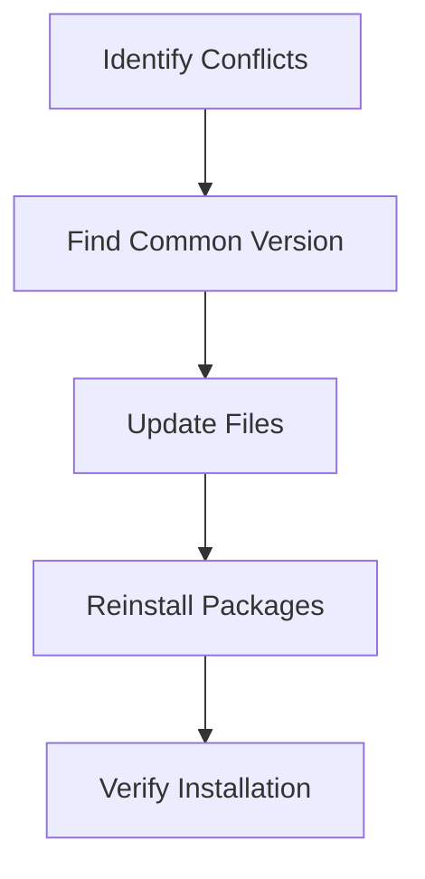

# Development Notes

- Created a virtual environment to manage dependencies effectively.
- Encountered and resolved a version conflict with the httpx package.
- Added .env to .gitignore to secure sensitive information.
- Installed whisperx and ctranslate2 from the correct branches to ensure compatibility.
- Regularly update the how_to_work.md file to reflect progress and next steps.

## Lesson: Handling Dependency Conflicts

**Dependency Conflict**: This happens when two or more packages require different versions of the same library, causing a conflict.

### Steps to Resolve Dependency Conflicts

1. **Identify Conflicts**: Look at error messages to see which packages have conflicting requirements.
2. **Find a Common Version**: Choose a version of the library that satisfies all packages.
3. **Update Files**: Modify `requirements.txt` or `pyproject.toml` to reflect the common version.
4. **Reinstall Packages**: Install the packages again to ensure everything works together.

### Example Code

- **requirements.txt**
  ```plaintext
  httpx==0.25.2
  ```

- **pyproject.toml**
  ```toml
  [tool.poetry.dependencies]
  httpx = "0.25.2"
  ```

### Mermaid Diagram



This practice helps maintain a clean and manageable codebase, especially in projects with multiple dependencies.
